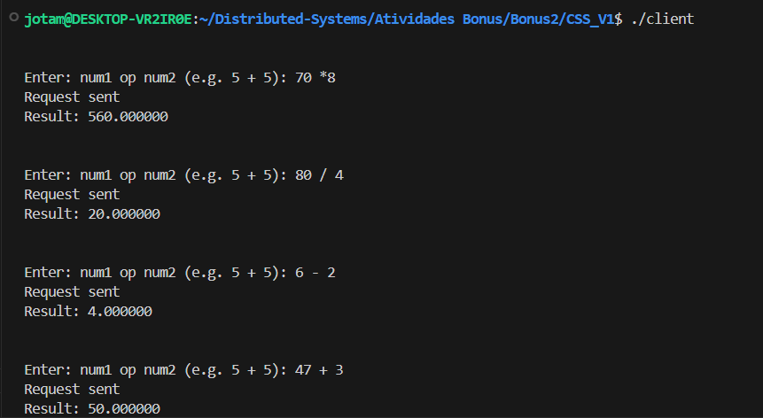
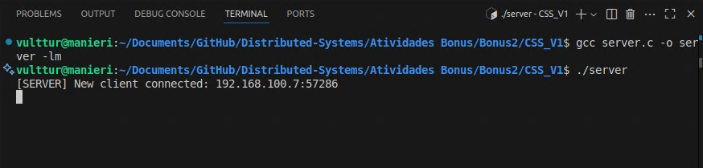
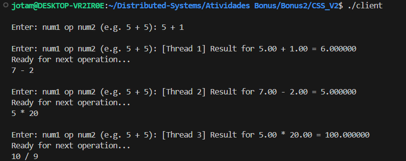
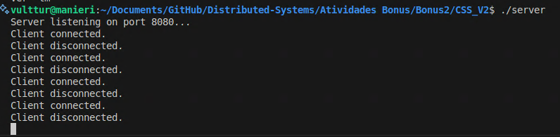
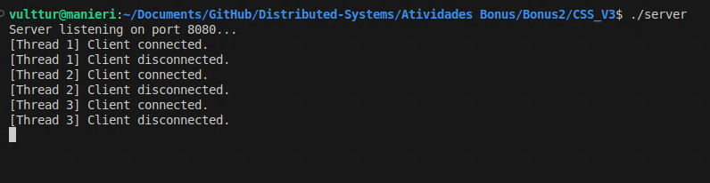

# Relatório – Atividade Bônus 2: IPC Remoto – Cliente/Servidor com Sockets TCP

**Disciplina**: Sistemas Distribuídos  
**Aluno**: João Otávio Manieri  
**Data da entrega**: 03/08  
**Atividade**: Implementação de Cliente-Servidor em C com diferentes abordagens (Singlethreaded, Multithreaded, FSM)

---

## 📌 Objetivo da Atividade

Implementar uma aplicação Cliente-Servidor em C usando a interface de sockets TCP/IP, simulando o funcionamento de uma calculadora distribuída. A aplicação foi desenvolvida em quatro versões:

- **CCS v1**: Cliente e servidor singlethreaded.
- **CCS v2**: Cliente multithreaded, servidor singlethreaded.
- **CCS v3**: Cliente e servidor multithreaded.
- **CCS v4**: Cliente multithreaded, servidor singlethreaded com FSM (Finite-State Machine).

---

## ⚙️ Ambiente de Execução

Para atender à exigência da atividade (cliente e servidor em máquinas diferentes), foi montado o seguinte ambiente de testes:

- **Servidor**:
  - Executado dentro de uma **VM Ubuntu 22.04 LTS** rodando via **VirtualBox** no modo **Bridge**, com IP interno acessível pela rede local (`192.168.100.36`).
  - Código-fonte `server.c` localizado na pasta `CCS_V*` correspondente a cada versão.

- **Cliente**:
  - Executado na máquina host (Windows 11), dentro do ambiente **WSL (Windows Subsystem for Linux)** com terminal 
  - Código-fonte `client.c` igualmente organizado por versão.
  - IP da VM referenciado diretamente no código do cliente com `inet_pton`.

---

## 🧱 Estrutura de Pastas

```bash
Distributed-Systems/
└── Atividades Bonus/
    └── Bonus2/
        ├── CCS_V1/
        ├── CCS_V2/
        ├── CCS_V3/
        └── CCS_V4/
```

Cada pasta contém dois arquivos:

- `client.c`
- `server.c`

---

## 🧪 Etapas, Testes e Dificuldades

Durante o processo de desenvolvimento e testes, as seguintes etapas e obstáculos foram enfrentados:

- Inicialmente testamos em Codespaces (GitHub), mas descobrimos que Codespaces não têm acesso à rede local, o que impossibilita a comunicação com a VM.
- Tentamos validar usando o comando `tcpdump` na VM, o que confirmou que nenhum pacote chegava ao servidor.
- Decidimos então configurar o ambiente correto usando WSL no host (cliente) e VM no VirtualBox (servidor).
- Tivemos que compilar o cliente no Windows, o que exigiu a instalação do ambiente do WSL2, incluindo os pacotes:
  - `git`
  - `gcc`
  - `make`
- Enfrentamos o erro `undefined reference to sqrt / exp`, resolvido ao adicionar a flag `-lm` no `gcc`.
- Também corrigimos o erro de `read` não declarado adicionando `#include <unistd.h>`.

---

### 🔧 CCS v1 – Cliente e Servidor Singlethreaded


- **Cliente**:
<div align="center"></div>

  - Loop principal onde o usuário digita operação e operando.
  - Envia via socket TCP para o servidor.
  - Aguarda resposta síncrona e imprime na tela.

- **Servidor**:
<div align="center"></div>

  - Aceita uma única conexão via `accept()`.
  - Loop escutando requisições do cliente.
  - Processa operação simples (+, *, ^, s, !) e retorna resultado.

**Observações**:
- Implementação direta e funcional.
- Comunicação síncrona, bloqueante.

---

### 🔧 CCS v2 – Cliente Multithreaded, Servidor Singlethreaded

- **Cliente**:
<div align="center"></div>

  - Para cada operação do usuário, cria uma nova thread com `pthread_create`.
  - Cada thread se conecta ao servidor, envia a operação e aguarda a resposta.
  - Resultado da operação é impresso com ID da thread.

- **Servidor**:
<div align="center"></div>

  - Mesmo servidor do V1 (singlethreaded).
  - Processa uma requisição por vez.

**Observações**:
- Cliente permite múltiplas requisições simultâneas.
- Servidor ainda responde uma por vez.

---

### 🔧 CCS v3 – Cliente e Servidor Multithreaded

- **Cliente**:
<div align="center"></div>
  - Idêntico ao V2: cada operação cria uma nova thread.

- **Servidor**:
<div align="center"></div>

  - Para cada `accept()`, cria uma nova thread dedicada ao socket.
  - Thread executa a operação, envia resultado e encerra.

**Observações**:
- Requisições paralelas dos dois lados.
- Conexões tratadas simultaneamente.

---

### 🔧 CCS v4 – Cliente Multithreaded, Servidor Singlethreaded com FSM

- **Cliente**:
<div align="center"></div>
  - Mesmo comportamento do V2/V3: multithreaded com `pthread_create`.

- **Servidor**:
<div align="center"></div>

  - Usa multiplexação (como `select()` ou controle de estado) para simular simultaneidade com uma única thread.
  - Slot FSM é reutilizado para cada cliente.

**Observações**:
- Mais difícil de implementar corretamente.
- Ideal para sistemas de alto desempenho com limitação de threads.

---


## 📦 Repositório do Código

O código-fonte de todas as versões se encontra no repositório GitHub:

🔗 [https://github.com/JoaoManierii/Distributed-Systems](https://github.com/JoaoManierii/Distributed-Systems/tree/main/Atividades%20Bonus/Bonus2)

---

## ✅ Conclusão

A atividade proporcionou uma excelente oportunidade para revisar conceitos de comunicação entre processos (IPC) em rede, incluindo:

- Uso de sockets TCP com C no Linux e Windows.
- Compilação cross-platform.
- Execução distribuída entre hosts distintos.
- Implementação de multithreading com `pthread`.
- Estrutura de FSM para controle de conexões em servidor singlethreaded.

Apesar dos desafios iniciais, o ambiente foi corretamente configurado e todas as versões foram implementadas com sucesso, funcionando conforme os requisitos propostos.